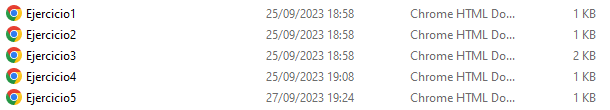
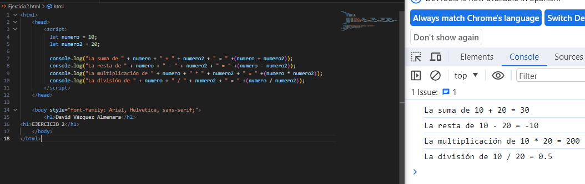
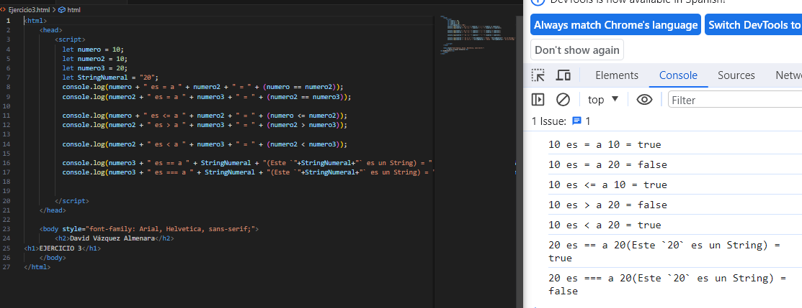
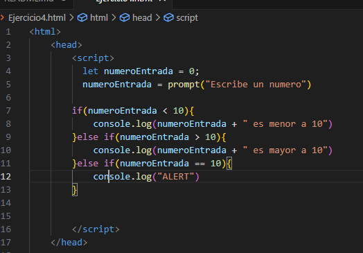
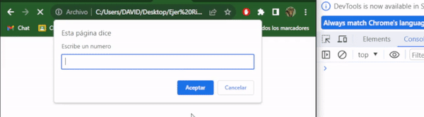
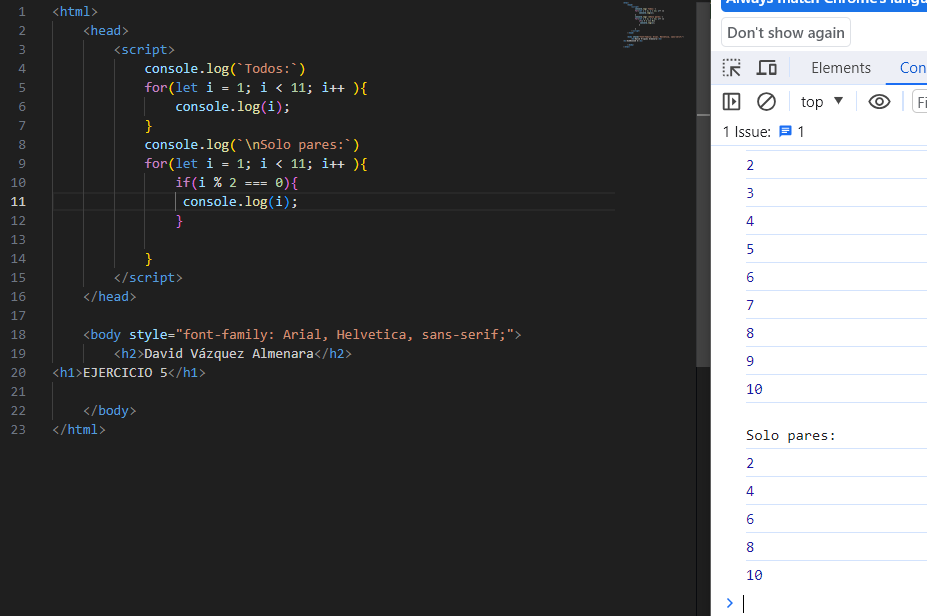

## 🤔 Análisis del problema
```
-> Se requiere realizar los siguientes ejercicios:

    ◽ Ejercicio 1: Declaración y Tipos de Datos

    ◽ Ejercicio 2: Operaciones Aritméticas

    ◽ Ejercicio 3: Comparaciones

    ◽ Ejercicio 4: Estructuras Condicionales

    ◽ Ejercicio 5: Bucles


```


## 🤓 Diseño de la solución
Para realizar este apartado de Tarea AVANZADA, lo primero que he hecho es ver el vídeo del profesor y ponerme a hacer correctamente los
componentes.

## 👨‍🎓 Implementación de la solución
En este apartado voy a implementar todos los apartados anteriores, a hacer los ejercicios al completo y los gifs de cada
prueba.



## 💡 Pruebas

### Ejercicio 1 - Declaración y Tipos de Datos
-> Objetivo: Familiarizarse con la declaración de variables y la identificación de tipos de datos.

1. Declara una variable para cada tipo de dato: Number, String, Boolean, Object, Null y Undefined.

2. Utiliza console.log para mostrar el valor y el tipo de cada variable.


En este ejercicio podemos observar como hago el uso del "var" para declarar varias variables y el uso del "console.log" para ponerlas en la terminal.


### Ejercicio 2 - Operaciones Aritméticas
-> Objetivo: Realizar operaciones aritméticas básicas.

1. Declara dos variables numéricas.

2. Realiza y muestra en la consola las operaciones de suma, resta, multiplicación, división y módulo entre estas variables.



En este ejercicio se puede comprobar como gracias al uso del "let"
declaro varias variables para después proceder a hacer varios cálculos matemáticos con ellas.


### Ejercicio 3 - Comparaciones

-> Objetivo: Comprender los operadores de comparación y cómo funcionan.

1. Declara tres variables con diferentes valores.

2. Utiliza operadores de comparación para comparar estas variables entre sí y muestra los resultados en la consola.




En este ejercicio declaró tres variables y procedo a compararlas
entre ellas para ver si son mayor o menor o igual. Hay que recalcar el uso de "==" e "===", el resultado de estas comparaciones es distinto ya que "==" compara si el `valor` es identico y "===" compara si este `valor` es identico y si la variable
es la misma (Numérico, String, boolean...)


### Ejercicio 4 - Estructuras Condicionales

-> Objetivo: Implementar estructuras condicionales para controlar el flujo del programa.

1. Escribir un programa que tome un número como entrada.

2. Si el número es mayor que 10, mostrar un mensaje indicando que es mayor. Si es menor, mostrar otro mensaje. Si es exactamente 10, mostrar un mensaje indicativo. (alert)

#### Codigo


#### Gif


En este ejercicio usamos el comando "prompt" para hacer que el usuario
introduzca un valor. Una vez que obtenemos el valor que el usuario ha introducido lo comparamos para saber si es menor, mayor o igual a 10.
En el caso de que sea igual a 10, la terminal nos dará un aviso de alerta


### Ejercicio 5 - Bucles

-> Objetivo: Implementar bucles para repetir acciones múltiples veces.

1. Escribir un bucle que muestre en la consola los números del 1 al 10.

2. Modificar el bucle anterior para mostrar solo los números pares entre 1 y 10.




En este ejercicio hacemos uso del bucle "for" para imprimir por terminar
los números del 1 al 10. 
A continuación vuelvo a usar este mismo bucle pero usando un "if" y "else"
para comparar cuáles son pares y cuáles no, y de esta manera únicamente imprimir los números pares.

