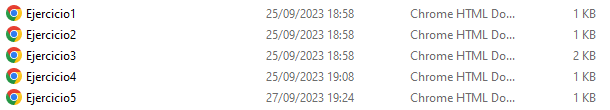

## 🤔 Análisis del problema
```
-> Se requiere realizar los siguientes ejercicios:

    ◽ Ejercicio 1: Cambio de Color con Botón

    ◽ Ejercicio 2: Calculadora de Área

    ◽ Ejercicio 3:  Listado Dinámico

    ◽ Ejercicio 4: Hover y Estilo Dinámico

    ◽ Ejercicio 5: Detección de Clics y Generación de XPath


```


## 🤓 Diseño de la solución
Para realizar este apartado de Tarea AVANZADA, lo primero que he hecho es leer el Boletín de Ejercicios y ponerme a hacer correctamente los
componentes.


## 💡 Pruebas

En este apartado voy a implementar todos los apartados anteriores, a hacer los ejercicios al completo y los gifs de cada
prueba.


