## 🤔 Análisis del problema
```
-> Se requiere realizar los siguientes ejercicios:

    ◽ Ejercicio 1: Filtrado de propiedades de un objeto

    ◽ Ejercicio 2: Transposición de matrices

    ◽ Ejercicio 3: Fusión de objetos sin duplicados

    ◽ Ejercicio 4: Cadena más larga en un array

    ◽ Ejercicio 5: Ordenamiento interactivo de tabla de personas

    ◽ Ejercicio 6: Análisis y Transformación Avanzada de Datos


```


## 🤓 Diseño de la solución
Para realizar este apartado de Tarea AVANZADA, lo primero que he hecho es leer el Boletín de Ejercicios y ponerme a hacer correctamente los
componentes.


## 💡 Pruebas

En este apartado voy a implementar todos los apartados anteriores, a hacer los ejercicios al completo y los gifs de cada
prueba.

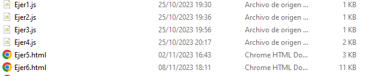


### 🔰 Ejercicio 1 -   Filtrado de propiedades de un objeto
-> Objetivo: Dado un objeto y una lista de propiedades, escribe una función que devuelva un nuevo objeto solo con las propiedades indicadas.

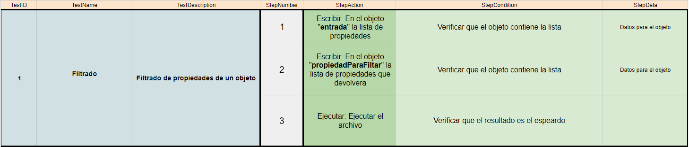

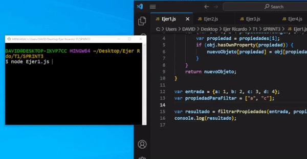


### 🔰 Ejercicio 2 -  Transposición de matrices
-> Objetivo: Dada una matriz, escribe una función que devuelva la transposición de esa matriz.

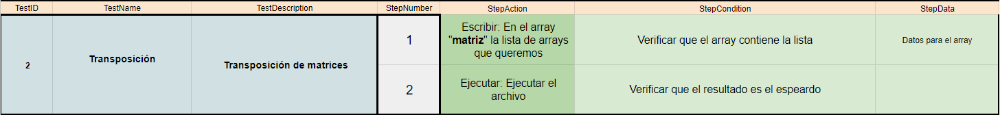

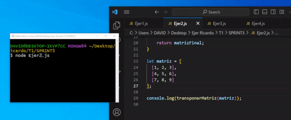


### 🔰 Ejercicio 3 - Fusión de objetos sin duplicados
-> Objetivo: Dado dos objetos, escribe una función que los fusiona en uno solo. Si hay propiedades repetidas, conserva el valor del segundo objeto.

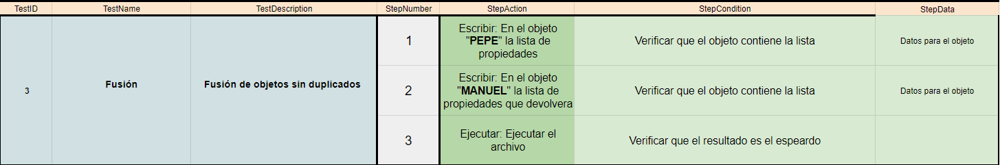

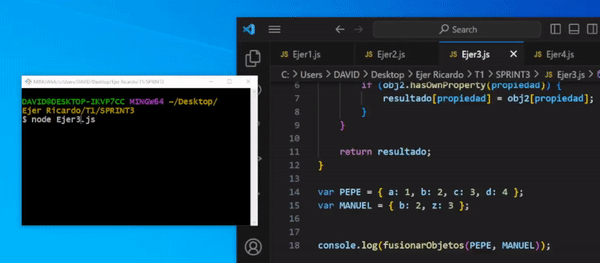

### 🔰 Ejercicio 4 - Cadena más larga en un array
-> Objetivo: Escribe una función que, dado un array de cadenas, devuelva la cadena más larga y su longitud.

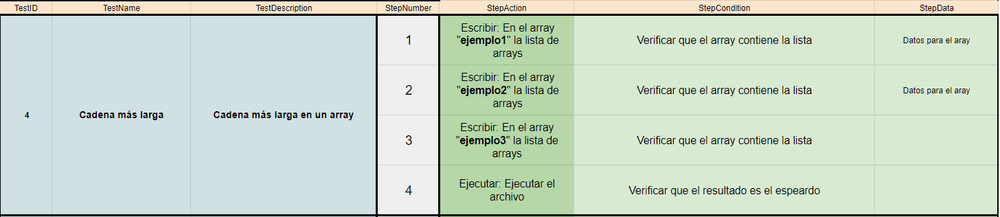

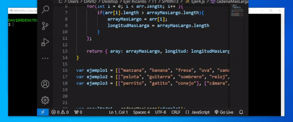

### 🔰 Ejercicio 5 - Ordenamiento interactivo de tabla de personas
-> Objetivo: Dada una tabla de personas con las columnas "Nombre", "Edad", "DNI", "Tiene/No tiene hijos" y "Fecha de nacimiento", escribe una función que permita ordenar la tabla por cualquiera de esas columnas. La columna "Fecha de nacimiento" debe tener el formato DD/MM/AAAA.

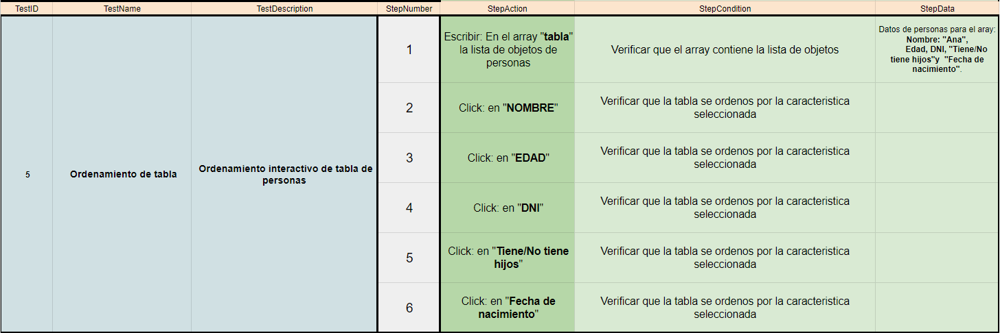

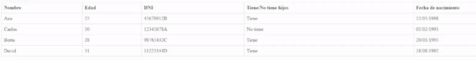

### 🔰 Ejercicio 6 - Ordenamiento interactivo de tabla de personas
-> Objetivo: Dado un conjunto de datos en forma de array con información sobre estudiantes, sus calificaciones en diferentes asignaturas y detalles adicionales, implementa funciones para analizar, filtrar y transformar estos datos.

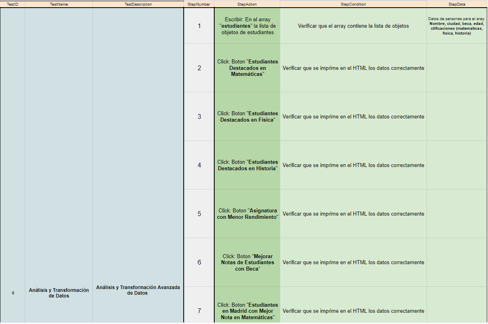
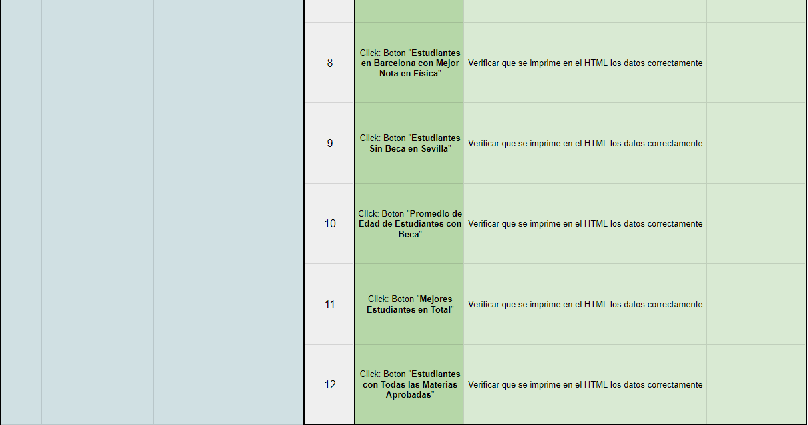
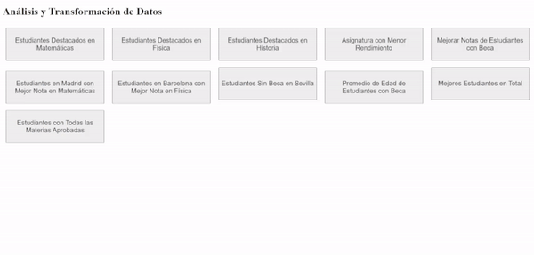


