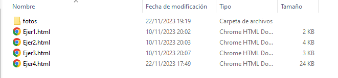
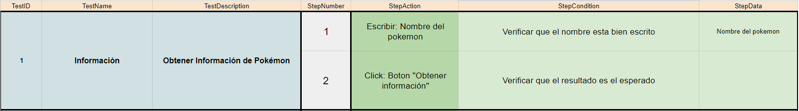
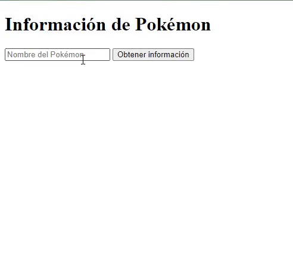
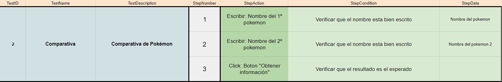
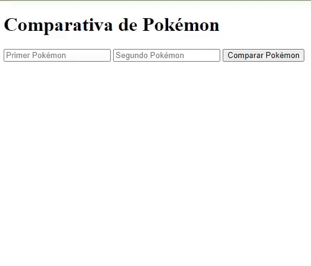
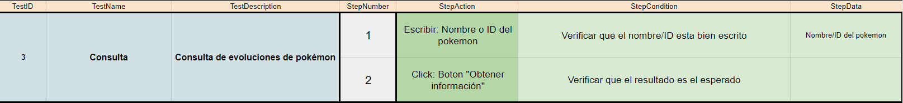
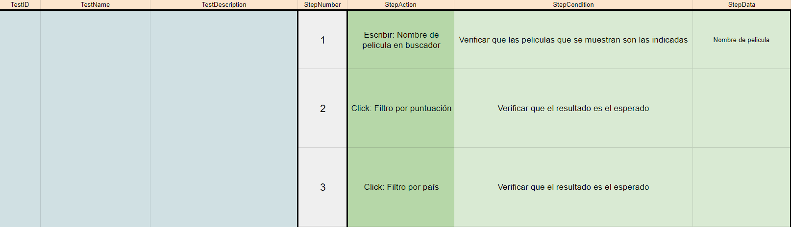
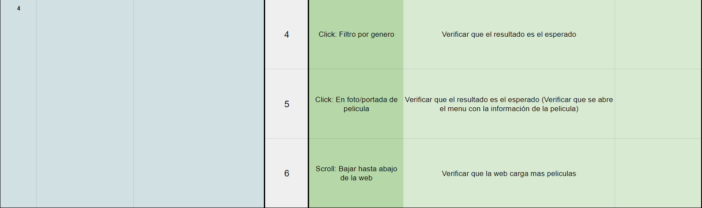

## 🤔 Análisis del problema
```
-> Se requiere realizar los siguientes ejercicios:

    ◽ Ejercicio 1: Información Básica del Pokémon

    ◽ Ejercicio 2: Comparativa de Pokémon

    ◽ Ejercicio 3: Evoluciones y Habilidades

    ◽ Ejercicio 4: Explorador de Películas


```


## 🤓 Diseño de la solución
Para realizar este apartado de Tarea AVANZADA, lo primero que he hecho es leer el Boletín de Ejercicios y ponerme a hacer correctamente los
componentes.


## 💡 Pruebas

En este apartado voy a implementar todos los apartados anteriores, a hacer los ejercicios al completo y los gifs de cada
prueba.




### 🔰 Ejercicio 1 -  Información Básica del Pokémon
-> Objetivo: Realizar una petición a la PokeAPI para obtener información básica de un Pokémon por su nombre.






### 🔰 Ejercicio 2 -  Comparativa de Pokémon
-> Objetivo: Obtener datos de dos Pokémon elegidos por el usuario.






### 🔰 Ejercicio 3 -  Evoluciones y Habilidades
-> Objetivo: Dado un Pokémon específico, buscar su cadena de evolución completa.




### 🔰 Ejercicio 4 - Explorador de Películas
-> Objetivo: Crear una aplicación web que permita a los usuarios explorar películas basándose en diferentes criterios como género. Usar la API The Movie DB (TMDB API)





