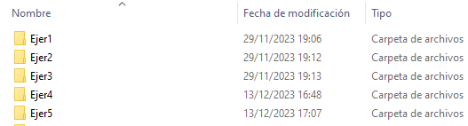
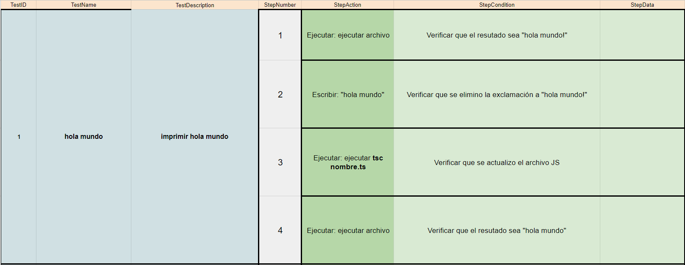
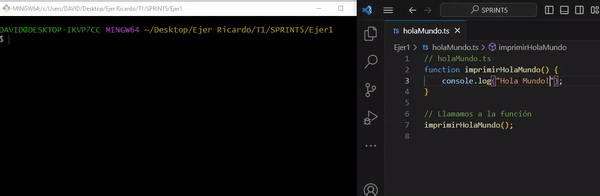

## 🤔 Análisis del problema


### Typescript

#### Conceptos Básicos de TypeScript

TypeScript es un superset de JavaScript que agrega tipos estáticos al lenguaje. Proporciona ventajas como la detección de errores durante el desarrollo y una mayor capacidad de autocompletado en entornos de desarrollo integrados (IDEs).

#### Tipos de Datos en TypeScript:
TypeScript incluye tipos de datos como string, number, boolean, array, tuple, enum, any, void, null, undefined, etc. Además, permite la creación de tipos personalizados a través de interfaces y tipos.

#### Interfaces en TypeScript:
Las interfaces en TypeScript definen la forma de un objeto y pueden ser utilizadas para definir contratos que deben cumplir otras partes del código. Esto mejora la legibilidad y mantenimiento del código.

#### Decoradores en TypeScript:
Los decoradores son una característica de TypeScript que permite modificar o extender clases y sus miembros durante el tiempo de compilación. Son comúnmente utilizados en frameworks como Angular.

#### Función en JavaScript:
Una función en JavaScript es un bloque de código diseñado para realizar una tarea específica. Puede aceptar datos de entrada (parámetros), procesarlos y devolver un resultado.

#### Definición y Declaración de Funciones:
La definición de una función especifica su estructura, mientras que la declaración la pone en práctica. Pueden ser declaradas mediante la palabra clave function.

#### Parámetros y Argumentos:
Los parámetros son variables que se definen en la firma de la función, mientras que los argumentos son los valores reales que se pasan a la función cuando es llamada.

#### Return y Valores de Retorno:
La palabra clave return se utiliza para devolver un valor desde una función. Si no se especifica, la función devuelve undefined.

#### Funciones Anónimas y Expresiones de Función:
Las funciones pueden ser anónimas (sin nombre) o nombradas. Las expresiones de función son formas de definir funciones en líneas de código, y pueden ser anónimas o nombradas también.

#### Eventos en JavaScript:
Los eventos son acciones o sucesos que ocurren en la página web, como clics del mouse, cambios de tamaño de ventana, etc.

#### Métodos de Manejo de Eventos: .addEventListener():
El método addEventListener() se utiliza para adjuntar un evento a un elemento del DOM. Permite especificar la función que se ejecutará cuando ocurra el evento.

#### Introducción al DOM:
El DOM (Document Object Model) es una representación del documento HTML/XML que proporciona una interfaz para interactuar y manipular la estructura del documento.

#### Seleccionar Elementos del DOM: querySelector y getElementById:
Estos métodos permiten seleccionar elementos del DOM. querySelector utiliza selectores CSS, mientras que getElementById selecciona un elemento por su identificador único.


```
-> Se requiere realizar los siguientes ejercicios:

    ◽ Ejercicio 1: "Hola Mundo" en TypeScript

    ◽ Ejercicio 2: Función con Tipos Básicos con Typescript

    ◽ Ejercicio 3: Uso de Interfaces con Typescript

    ◽ Ejercicio 4: Manipulación de Arrays con Typescript

    ◽ Ejercicio 5: Crear una Pokedex con PokeAPI con Typescript

```


## 🤓 Diseño de la solución
Para realizar este apartado de Tarea AVANZADA, lo primero que he hecho es leer el Boletín de Ejercicios y ponerme a hacer correctamente los
componentes.


## 💡 Pruebas

En este apartado voy a implementar todos los apartados anteriores, a hacer los ejercicios al completo y los gifs de cada
prueba.




### 🔰 Ejercicio 1 -  "Hola Mundo" en TypeScript
-> Objetivo: Crear un programa simple que imprima "Hola Mundo" en la consola.




