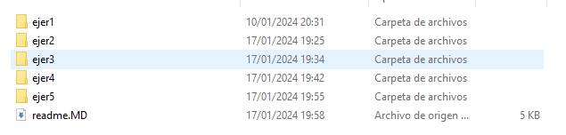
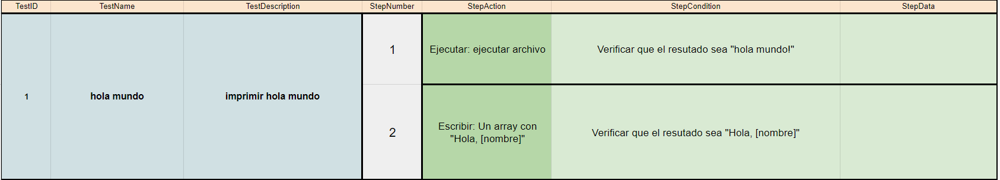
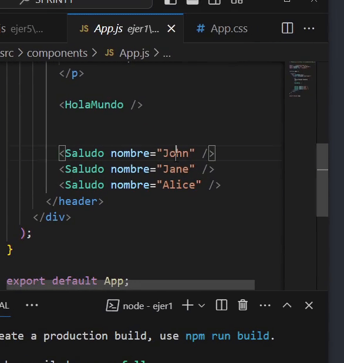
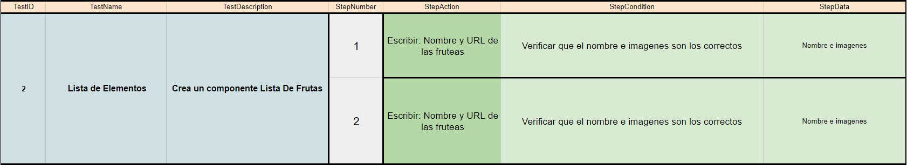
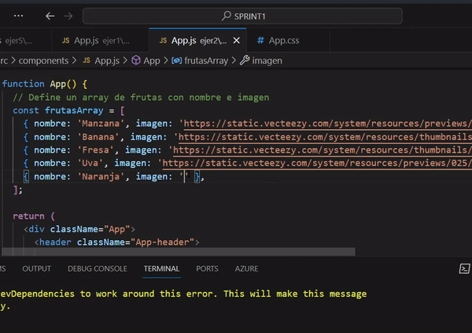
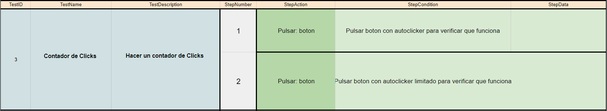
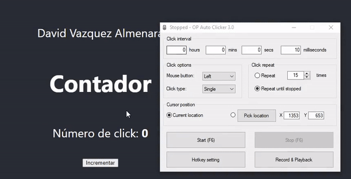
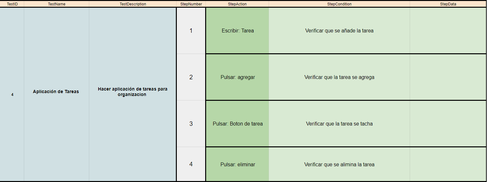
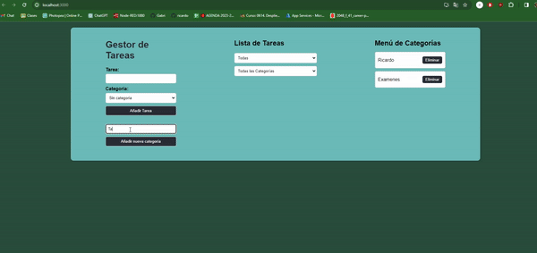

## 🤔 Análisis del problema


### Diferencias entre Angular y React

## Arquitectura

### Angular
- **Arquitectura:** Framework MVVM (Model-View-ViewModel).
- **Lenguaje:** Escrito en TypeScript.
- **Módulos:** Utiliza módulos para organizar la aplicación.
- **Plantillas:** Utiliza plantillas HTML.

### React
- **Arquitectura:** Biblioteca basada en componentes.
- **Lenguaje:** Principalmente JSX (JavaScript XML).
- **Módulos:** Organiza la aplicación en componentes reutilizables.
- **Plantillas:** Utiliza JSX para definir la interfaz de usuario.

## Estado de la Aplicación

### Angular
- **Estado:** Utiliza servicios y dependencias para manejar el estado de la aplicación.
- **Unidireccional:** Sigue el flujo unidireccional de datos.

### React
- **Estado:** Utiliza el estado interno de los componentes y el contexto para gestionar el estado de la aplicación.
- **Unidireccional:** Fomenta el flujo unidireccional de datos, pero también permite el uso de estados locales.

## Rendering

### Angular
- **Rendering:** Utiliza un enfoque de rendering basado en el DOM.
- **Virtual DOM:** No utiliza un Virtual DOM como React.

### React
- **Rendering:** Utiliza un Virtual DOM para optimizar el rendering.
- **Reconciliación:** Realiza una reconciliación eficiente para actualizar solo las partes modificadas del DOM.

## Herramientas y Flexibilidad

### Angular
- **Herramientas:** Viene con un conjunto integrado de herramientas.
- **Opinión:** Sigue el principio de "opinión fuerte".

### React
- **Herramientas:** Puedes elegir tus propias herramientas y librerías.
- **Flexibilidad:** Ofrece más flexibilidad y se adapta a diferentes enfoques de desarrollo.

## Curva de Aprendizaje

### Angular
- **Curva:** Mayor curva de aprendizaje debido a su complejidad y a la cantidad de conceptos que involucra.

### React
- **Curva:** Generalmente considerada más fácil de aprender, especialmente para desarrolladores familiarizados con JavaScript.

## Comunidad y Adopción

### Angular
- **Comunidad:** Tiene una comunidad sólida y amplia.
- **Adopción:** Ampliamente utilizado en grandes empresas y proyectos.

### React
- **Comunidad:** Una de las comunidades más grandes y activas.
- **Adopción:** Muy popular, especialmente en startups y proyectos más pequeños.


```
-> Se requiere realizar los siguientes ejercicios:

    ◽ Ejercicio 1: "Hola Mundo" en TypeScript

    ◽ Ejercicio 2: Función con Tipos Básicos con Typescript

    ◽ Ejercicio 3: Uso de Interfaces con Typescript

    ◽ Ejercicio 4: Manipulación de Arrays con Typescript

    ◽ Ejercicio 5: Crear una Pokedex con PokeAPI con Typescript

```


## 🤓 Diseño de la solución
Para realizar este apartado de Tarea AVANZADA, lo primero que he hecho es leer el Boletín de Ejercicios y ponerme a hacer correctamente los
componentes.


## 💡 Pruebas

En este apartado voy a implementar todos los apartados anteriores, a hacer los ejercicios al completo y los gifs de cada
prueba.




### 🔰 Ejercicio 1 -  "Hola Mundo" en TypeScript
-> Objetivo: Crear un programa simple que imprima "Hola Mundo" en la consola.





### 🔰 Ejercicio 2 -  Función con Tipos Básicos con Typescript
-> Objetivo: Escribir una función que acepte un nombre (string) y una edad (number) y devuelva un saludo personalizado.





### 🔰 Ejercicio 3 -  Uso de Interfaces con Typescript
-> Objetivo: Crear una interfaz para un objeto "Usuario" y utilizarla para crear un usuario.





### 🔰 Ejercicio 4 -  Manipulación de Arrays con Typescript
-> Objetivo: Crear una aplicación simple que maneje una lista de tareas (to-do list) usando arrays en TypeScript.




### 🔰 Ejercicio 5 -  Crear una Pokedex con PokeAPI con Typescript
-> Objetivo: Construir una aplicación en TypeScript que utilice la PokeAPI para mostrar información de Pokémon.



