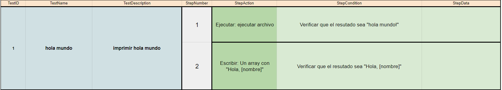
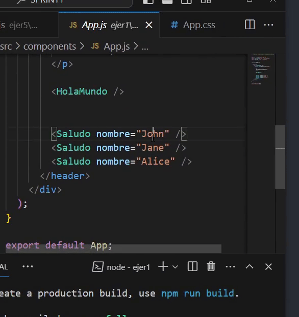
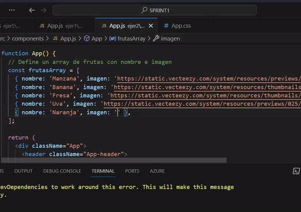
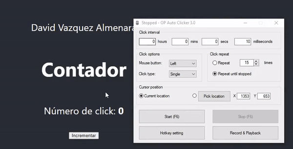
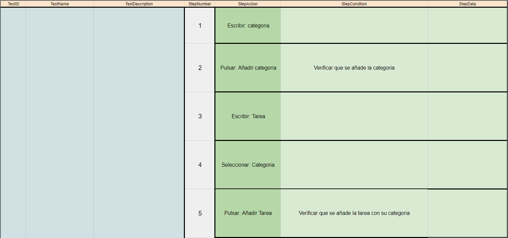
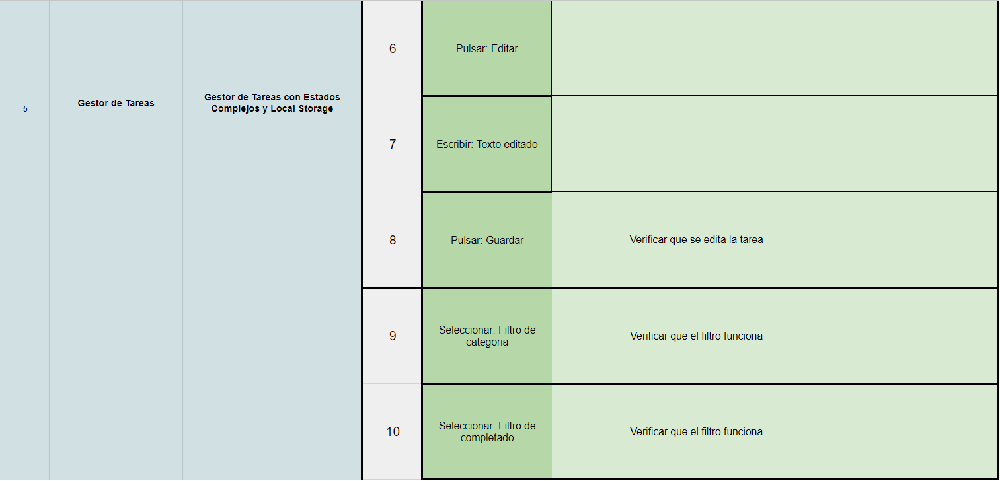
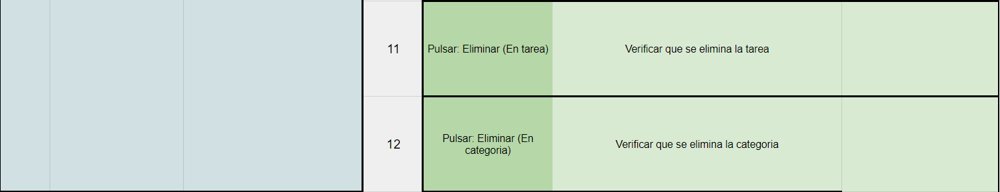

## 🤔 Análisis del problema

# Angular vs. React

## Arquitectura

### Angular
- **Arquitectura:** Framework MVVM (Model-View-ViewModel).
- **Lenguaje:** Escrito en TypeScript.
- **Módulos:** Utiliza módulos para organizar la aplicación.
- **Plantillas:** Utiliza plantillas HTML.

### React
- **Arquitectura:** Biblioteca basada en componentes.
- **Lenguaje:** Principalmente JSX (JavaScript XML).
- **Módulos:** Organiza la aplicación en componentes reutilizables.
- **Plantillas:** Utiliza JSX para definir la interfaz de usuario.

## Estado de la Aplicación

### Angular
- **Estado:** Utiliza servicios y dependencias para manejar el estado de la aplicación.
- **Unidireccional:** Sigue el flujo unidireccional de datos.

### React
- **Estado:** Utiliza el estado interno de los componentes y el contexto para gestionar el estado de la aplicación.
- **Unidireccional:** Fomenta el flujo unidireccional de datos, pero también permite el uso de estados locales.

## Rendering

### Angular
- **Rendering:** Utiliza un enfoque de rendering basado en el DOM.
- **Virtual DOM:** No utiliza un Virtual DOM como React.

### React
- **Rendering:** Utiliza un Virtual DOM para optimizar el rendering.
- **Reconciliación:** Realiza una reconciliación eficiente para actualizar solo las partes modificadas del DOM.

## Herramientas y Flexibilidad

### Angular
- **Herramientas:** Viene con un conjunto integrado de herramientas.
- **Opinión:** Sigue el principio de "opinión fuerte".

### React
- **Herramientas:** Puedes elegir tus propias herramientas y librerías.
- **Flexibilidad:** Ofrece más flexibilidad y se adapta a diferentes enfoques de desarrollo.

## Curva de Aprendizaje

### Angular
- **Curva:** Mayor curva de aprendizaje debido a su complejidad y a la cantidad de conceptos que involucra.

### React
- **Curva:** Generalmente considerada más fácil de aprender, especialmente para desarrolladores familiarizados con JavaScript.

## Comunidad y Adopción

### Angular
- **Comunidad:** Tiene una comunidad sólida y amplia.
- **Adopción:** Ampliamente utilizado en grandes empresas y proyectos.

### React
- **Comunidad:** Una de las comunidades más grandes y activas.
- **Adopción:** Muy popular, especialmente en startups y proyectos más pequeños.


```
-> Se requiere realizar los siguientes ejercicios:

    ◽ Ejercicio 1: Hola Mundo en React y Componente con Props

    ◽ Ejercicio 2: Lista de Elementos

    ◽ Ejercicio 3: Contador de Clicks

    ◽ Ejercicio 4: Aplicación de Tareas

    ◽ Ejercicio 5: Gestor de Tareas con Estados Complejos y Local Storage

```


## 🤓 Diseño de la solución
Para realizar este apartado de Tarea AVANZADA, lo primero que he hecho es leer el Boletín de Ejercicios y ponerme a hacer correctamente los
componentes.


## 💡 Pruebas

En este apartado voy a implementar todos los apartados anteriores, a hacer los ejercicios al completo y los gifs de cada
prueba.


### 🔰 Ejercicio 1 - Hola Mundo en React y Componente con Props
-> Objetivo: Crea un componente funcional llamado HolaMundo que simplemente renderice un elemento h1 con el texto "¡Hola, Mundo!".






### 🔰 Ejercicio 2 - Lista de Elementos
-> Objetivo: Crea un componente ListaDeFrutas que renderice una lista (ul) de elementos (li).





### 🔰 Ejercicio 3 - Contador de clicks
-> Objetivo: Crea un componente Contador que muestre un número (inicialmente 0) y un botón.





### 🔰 Ejercicio 4 - Contador de clicks
-> Objetivo: Crea una aplicación de lista de tareas (ToDoApp) que permita al usuario añadir tareas, marcarlas como completadas y borrarlas.


### 🔰 Ejercicio 5 - Contador de clicks
Desarrollar una aplicación de gestión de tareas (to-do list) avanzada en React que no solo permita añadir, marcar y eliminar tareas, sino también categorizarlas y persistir los datos en el navegador usando Local Storage.






