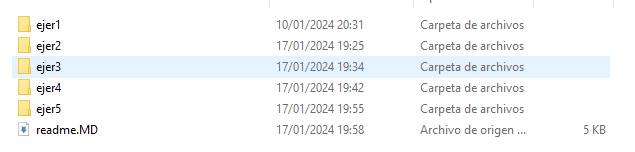
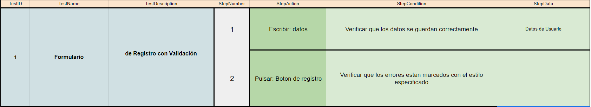
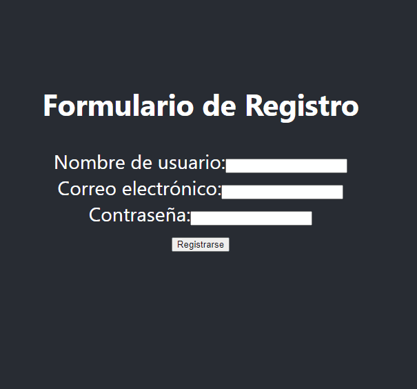
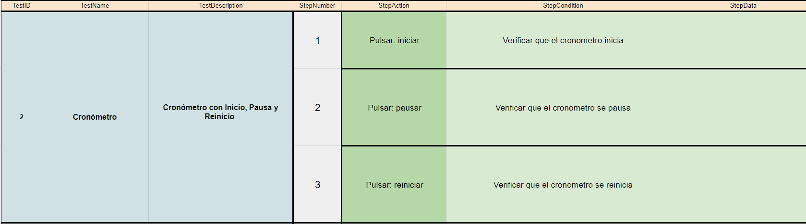
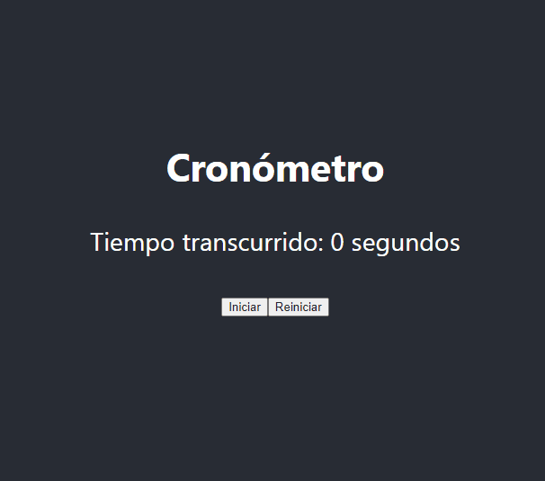
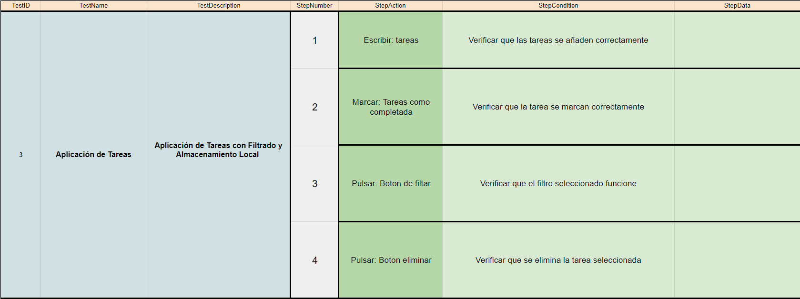
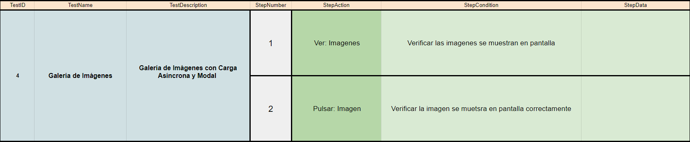
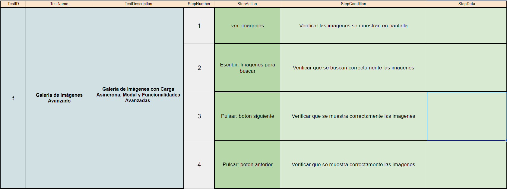

## 🤔 Análisis del problema

```
-> Se requiere realizar los siguientes ejercicios:

    ◽ Ejercicio 1: Formulario de Registro con Validación

    ◽ Ejercicio 2: Cronómetro con Inicio, Pausa y Reinicio

    ◽ Ejercicio 3: Aplicación de Tareas con Filtrado y Almacenamiento Local

    ◽ Ejercicio 4: Galería de Imágenes con Carga Asíncrona y Modal

    ◽ Ejercicio 5: Galería de Imágenes con Carga Asíncrona, Modal y Funcionalidades Avanzadas

```


## 🤓 Diseño de la solución
Para realizar este apartado de Tarea AVANZADA, lo primero que he hecho es leer el Boletín de Ejercicios y ponerme a hacer correctamente los
componentes.


## 💡 Pruebas

En este apartado voy a implementar todos los apartados anteriores, a hacer los ejercicios al completo y los gifs de cada
prueba.




### 🔰 Ejercicio 1 - Formulario de Registro con Validación
-> Objetivo: Crear un componente de clase `FormularioRegistro` que incluya campos para el nombre de usuario, correo electrónico y contraseña, con validación de cada campo.






### 🔰 Ejercicio 2 - Cronómetro con Inicio, Pausa y Reinicio
-> Objetivo: Crear un componente de clase `Cronometro` que funcione como un cronómetro con botones para iniciar, pausar y reiniciar el tiempo.






### 🔰 Ejercicio 3 - Aplicación de Tareas con Filtrado y Almacenamiento Local
-> Objetivo: Crear una aplicación de tareas (`AppTareas`) que permita añadir, eliminar, filtrar tareas y almacenarlas en el almacenamiento local del navegador.




### 🔰 Ejercicio 4 - Galería de Imágenes con Carga Asíncrona y Modal
->Objetivo: Crear una galería de imágenes (`GaleriaImagenes`) que cargue imágenes de una API, las muestre en un grid y permita abrir una imagen en un modal al hacer clic.




### 🔰 Ejercicio 5 - Galería de Imágenes con Carga Asíncrona, Modal y Funcionalidades Avanzadas
-> Objetivo: Crear una galería de imágenes avanzada (GaleriaImagenesAvanzada) que cargue imágenes de una API, las muestre en un grid, permita abrir una imagen en un modal, y ofrezca funcionalidades adicionales como búsqueda y paginación.



