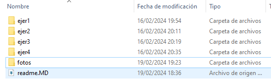
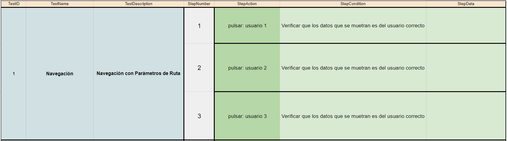
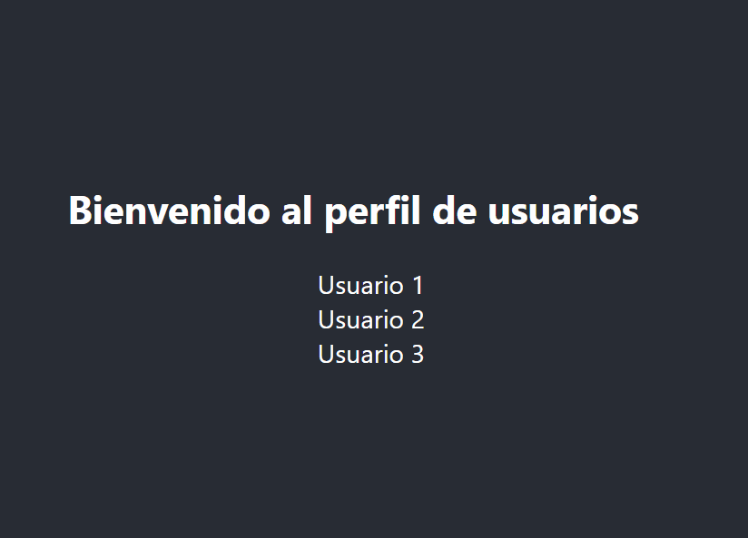
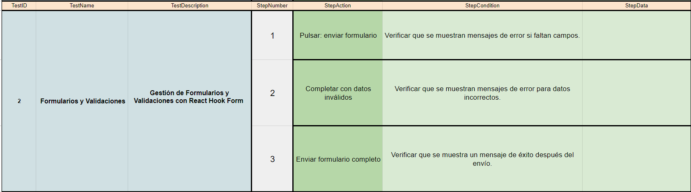
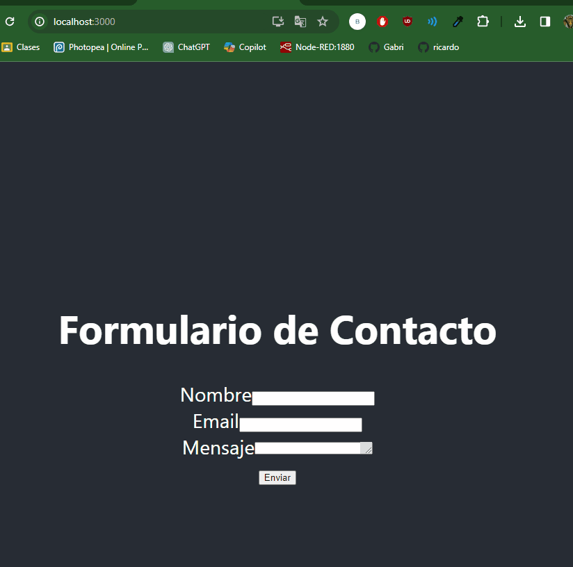
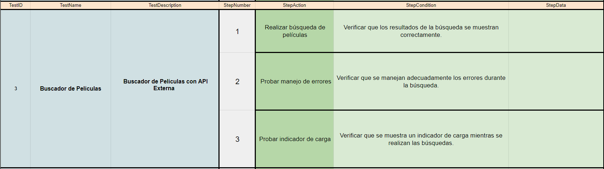
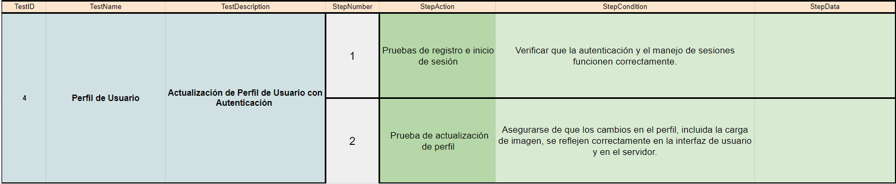

## 🤔 Análisis del problema

```
-> Se requiere realizar los siguientes ejercicios:

    ◽ Ejercicio 1: Formulario de Registro con Validación

    ◽ Ejercicio 2: Cronómetro con Inicio, Pausa y Reinicio

    ◽ Ejercicio 3: Aplicación de Tareas con Filtrado y Almacenamiento Local

    ◽ Ejercicio 4: Galería de Imágenes con Carga Asíncrona y Modal

    ◽ Ejercicio 5: Galería de Imágenes con Carga Asíncrona, Modal y Funcionalidades Avanzadas

```


## 🤓 Diseño de la solución
Para realizar este apartado de Tarea AVANZADA, lo primero que he hecho es leer el Boletín de Ejercicios y ponerme a hacer correctamente los
componentes.


## 💡 Pruebas

En este apartado voy a implementar todos los apartados anteriores, a hacer los ejercicios al completo y los gifs de cada
prueba.




### 🔰 Ejercicio 1: Navegación con Parámetros de Ruta
-> Objetivo: Crear una aplicación simple de perfil de usuario que utilice React Router para la navegación, donde cada perfil tenga su propia URL basada en el ID del usuario.






### 🔰 Ejercicio 2 - Gestión de Formularios y Validaciones con React Hook Form

-> Objetivo: Crear un formulario de contacto simple que valide la entrada del usuario antes de mostrar un mensaje de éxito, utilizando React Hook Form.






### 🔰 Ejercicio 3: Buscador de Películas con API Externa

-> Objetivo: Crear una aplicación que permita a los usuarios buscar películas por nombre usando la API de OMDB (Open Movie Database) y mostrar los resultados en la página.





### 🔰 Ejercicio 4: Actualización de Perfil de Usuario con Autenticación

->Objetivo: Crear una aplicación que permita a los usuarios registrarse, iniciar sesión y actualizar su perfil, incluyendo la carga de una imagen de perfil, interactuando con una API que requiere autenticación.




