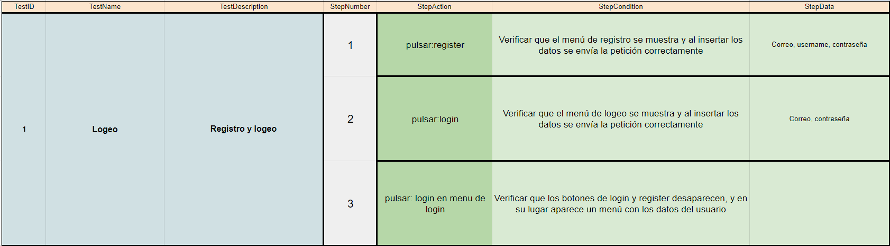
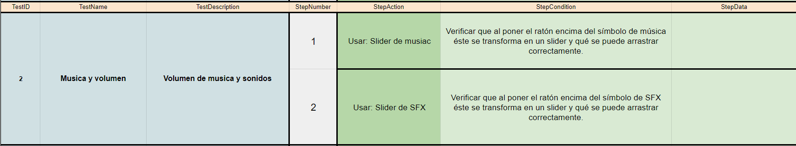
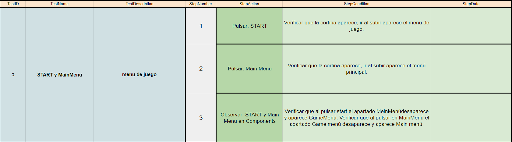
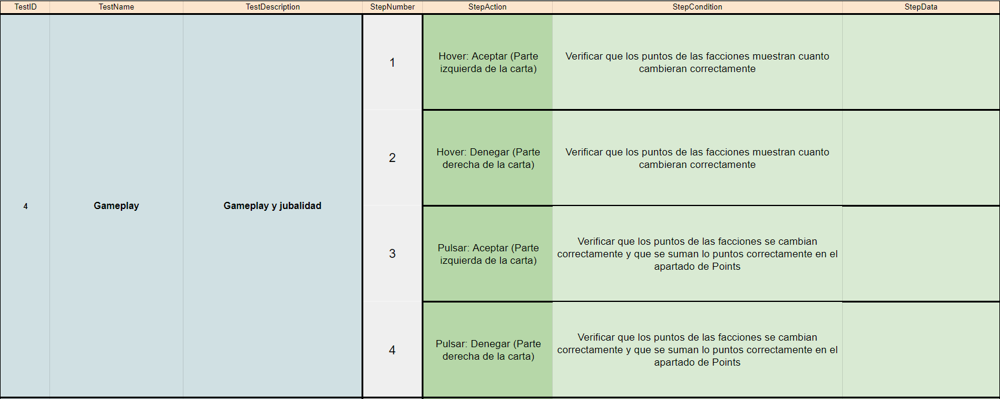
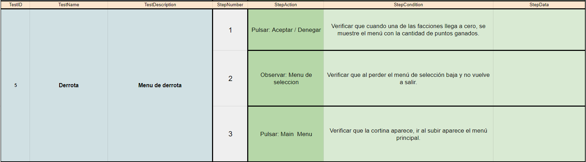

## 🤔 Análisis del problema

```
-> Se requiere realizar los siguientes ejercicios:

    ◽ Test 1: Registro y logeo de usuario

    ◽ Test 2: Volumen de musica y sonidos

    ◽ Test 3: Menu de juego

    ◽ Test 4: Gameplay y jubalidad

    ◽ Test 5: Menu de derrota

```


## 🤓 Diseño de la solución
Para realizar este apartado de Tarea AVANZADA, lo primero que he hecho es hacer la APP, obviamente :D .


## 💡 Pruebas

En este apartado voy a implementar todos los apartados anteriores, a hacer los test al completo y los gifs de cada
prueba.


### 🔰 Test 1: Registro y logeo de usuario
-> Objetivo: Verificar que el sistema de registro y logeo funciona correctamente




### 🔰 Test 2 - Volumen de musica y sonidos

-> Objetivo: Comprobar que los sliders de los volúmenes funcionan correctamente.




### 🔰 Test 3: Menu de juego

-> Objetivo: Verificar que al empezar el juego aparece el menú de juego y que al pulsar en el botón para volver al menú principal aparezca.




### 🔰 Test 4: Gameplay y jubalidad

->Objetivo: Comprobar que al hacer un hover muestra las facciones a las que afectara las decisiones y que al pulsar en ellas se aplican correctamente.




### 🔰 Test 5: Menu de derrota

->Objetivo: Verificar que al perder aparece el menú de derrota con la puntuación ganada y verificar que al pulsar el botón de volver al menú principal todo se reinicie.



